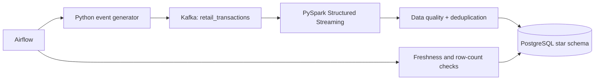

# Real-Time Retail Analytics Pipeline

An end-to-end streaming data engineering project that generates retail events, publishes them to Kafka, transforms them with PySpark Structured Streaming, and loads a PostgreSQL star schema for analytics.

## Architecture



## Engineering features

- Event-time processing with watermarks
- Schema enforcement and invalid-event quarantine
- Idempotent event IDs and duplicate removal
- Spark checkpointing for restart safety
- PostgreSQL fact/dimension model
- Airflow orchestration with retries and validation
- Docker Compose environment
- Unit tests and GitHub Actions CI

## Quick start

Requirements: Docker with Compose and at least 6 GB of available memory.

```bash
cp .env.example .env
docker compose up --build
```

Generate a bounded test stream:

```bash
docker compose run --rm producer python -m src.producer --events 10000 --rate 500
```

Connect to PostgreSQL:

```bash
docker compose exec postgres psql -U retail -d retail_analytics
```

```sql
SELECT date_key, store_id, SUM(net_amount) AS revenue
FROM fact_sales
GROUP BY 1, 2
ORDER BY 1 DESC, 3 DESC;
```

## Data model

- `fact_sales`: one row per transaction event
- `dim_product`: product and category attributes
- `dim_store`: store and region attributes
- `dim_date`: calendar attributes
- `quarantine_events`: invalid payloads and validation reasons

## Testing

```bash
python -m pip install -r requirements-dev.txt
pytest
```

## Benchmarking

The generator accepts `--events` and `--rate`, so throughput and latency can be measured on the target machine. The repository does **not** claim that every laptop will sustain 2M events/day or sub-five-minute latency. Record reproducible results with:

```bash
python scripts/benchmark.py --events 100000 --rate 1000
```

## Design decisions

- Kafka decouples event producers from processing consumers.
- Structured Streaming provides checkpointed micro-batch processing and event-time semantics.
- PostgreSQL keeps the demo easy to inspect while demonstrating dimensional modeling.
- Airflow coordinates operational tasks; Spark owns continuous stream processing.

## License

MIT
